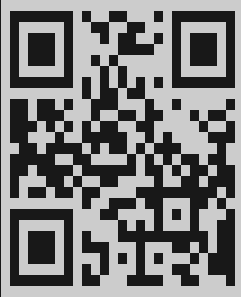

# How to use this app

Clone this repo. To start the application write a command:

```
npx expo start 
```

After starting of Metro Bundler, access it from `localhost:8081` or by scanning this QR-code through Expo Go:



Happy usage!